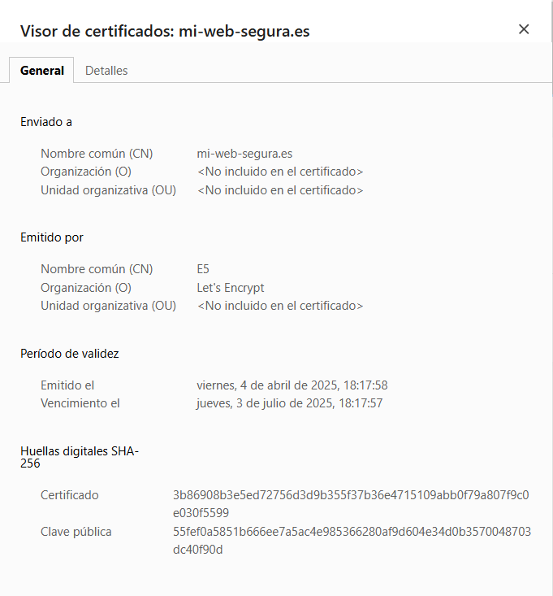
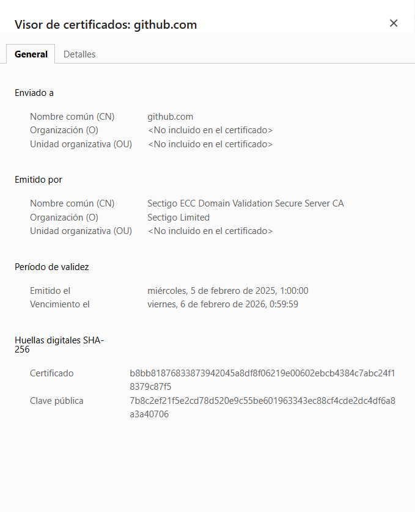

# Comparación de Certificados

### Certificado de mi-web-segura

### Certificado de GitHub

---

## Análisis y Comparación

En esta sección se comparan diversos aspectos de ambos certificados: emisor, sujeto, periodo de validez, uso de la clave, algoritmo de firma y cadena de confianza.

### 1. Emisor (Issuer)
- **Certificado mi-web-segura**: Emitido por **E5**, que pertenece a **Let's Encrypt**.  
  Let's Encrypt es una Autoridad de Certificación (CA) que emite certificados **DV (Domain Validation)** de forma gratuita.  

- **Certificado GitHub**: Emitido por **Sectigo ECC Domain Validation Secure CA**, perteneciente a **Sectigo Limited**.  
  Sectigo (antes Comodo) es una CA comercial reconocida a nivel mundial. El nombre “Domain Validation” en el emisor indica que también se trata de un certificado DV.  

### 2. Sujeto (Subject)
- **Certificado mi-web-segura**  
  - **Common Name (CN)**: `mi-web-segura.es`  
  - **Organization (O)**: No incluido en el certificado  
  - **Organizational Unit (OU)**: No incluido en el certificado  

  Al ser un certificado DV, solo se valida la titularidad del dominio. No aparece información adicional como la organización o la localidad.

- **Certificado GitHub**  
  - **Common Name (CN)**: `github.com`  
  - **Organization (O)**: No incluido en el certificado  
  - **Organizational Unit (OU)**: No incluido en el certificado  

  Aunque GitHub es una gran empresa, en este caso el certificado mostrado también es de tipo **Domain Validation**, pues no se incluyen datos de organización en el sujeto.

### 3. Periodo de Validez
- **Certificado mi-web-segura (Let's Encrypt)**:  
  - Válido aproximadamente 90 días (en la captura se ve que inicia el 4 de abril de 2025 y expira el 3 de julio de 2025).  
  - Let's Encrypt emite certificados con una validez de 90 días, fomentando la renovación frecuente para mayor seguridad.

- **Certificado GitHub (Sectigo)**:  
  - Válido alrededor de 1 año (en la captura se ve que inicia el 5 de febrero de 2025 y expira el 6 de febrero de 2026).  
  - Los certificados comerciales suelen tener una validez mayor que la de Let's Encrypt, típicamente entre 1 y 2 años (aunque cada vez más, los navegadores y la industria promueven duraciones más cortas).

### 4. Uso de la Clave (Key Usage) y Uso Extendido de Clave (Extended Key Usage)
En general, ambos certificados permiten:
- **Autenticación de servidor (TLS Web Server Authentication)**  
- **Firma digital (Digital Signature)**

Para certificados de servidor web estándar, estas son las finalidades típicas: asegurar la comunicación HTTPS (cifrado) y autenticar al servidor ante el cliente.

### 5. Algoritmo de Firma (Signature Algorithm)
- **Certificado mi-web-segura**:  
  - Probablemente utiliza **ECDSA** o **RSA** con **SHA-256** (Let's Encrypt maneja ambas opciones; en la actualidad sus intermedias “E1” y “R3” corresponden a ECDSA y RSA, respectivamente).  
  - La “huella digital (SHA-256)” mostrada en la captura no es exactamente el mismo campo que el algoritmo de firma, pero generalmente indica que la firma utiliza un hash SHA-256.

- **Certificado GitHub**:  
  - Emitido por **Sectigo ECC Domain Validation Secure CA**, lo que sugiere el uso de **ECC (Elliptic Curve Cryptography)** y, por ende, **ECDSA** con **SHA-256**.  
  - De igual manera, la huella digital SHA-256 confirma que el certificado utiliza un hash con SHA-256.

### 6. Cadena de Confianza (Certification Path)
- **Certificado mi-web-segura (Let's Encrypt)**  
  - Suele tener una cadena que incluye el certificado intermedio de **E1** y la raíz de **ISRG Root X2** (o la raíz cruzada en caso de compatibilidad).  
  - Todos los navegadores modernos reconocen a ISRG Root como CA raíz confiable, lo que permite la validación completa sin advertencias.

- **Certificado GitHub (Sectigo)**  
  - La cadena típica de Sectigo ECC Domain Validation Secure CA se encamina a una raíz de confianza de **Sectigo** (con frecuencia “USERTrust ECC Certification Authority” u otra raíz reconocida).  
  - Sectigo es ampliamente reconocido por los sistemas operativos y navegadores, por lo que el certificado se considera confiable sin necesidad de configuración especial.

---

**En conclusión**, ambos certificados son de tipo **DV (Domain Validation)**, aunque proceden de diferentes Autoridades de Certificación (Let's Encrypt vs. Sectigo). La principal diferencia radica en la **validez temporal** (90 días para Let's Encrypt frente a aproximadamente 1 año para el certificado de GitHub), y en la **marca comercial** del emisor. Por lo demás, en cuanto a uso, algoritmo de firma y cadena de confianza, ambos cumplen los requisitos de seguridad para servir contenido web de forma segura mediante HTTPS.
