# Análisis de Certificados SSL: Válido vs. Inválidos

---

## **Certificado Válido (mi-web-segura.es)**   

### **Validación**

1. **Confianza:**  
   - Emitido por **Let's Encrypt** (CA reconocida).  
   - Cadena completa hasta **ISRG Root X1** (raíz de confianza global).  
   - Marcado como **"Trusted"** en todos los navegadores/sistemas operativos.  

2. **Nombre (CN/SAN):**  
   - **CN:** `mi-web-segura.es`.  
   - **SAN:** `mi-web-segura.es`, `www.mi-web-segura.es`.  

3. **Validez Temporal:**  
   - **Válido desde:** 4 de abril de 2025.  
   - **Válido hasta:** 3 de julio de 2025 (2 meses y 28 días restantes).  

4. **Revocación:**  
   - **OCSP:** `http://e5.o.lencr.org` (estado: **no revocado**).  
   - **CRL:** `http://e5.c.lencr.org/106.crl`.  

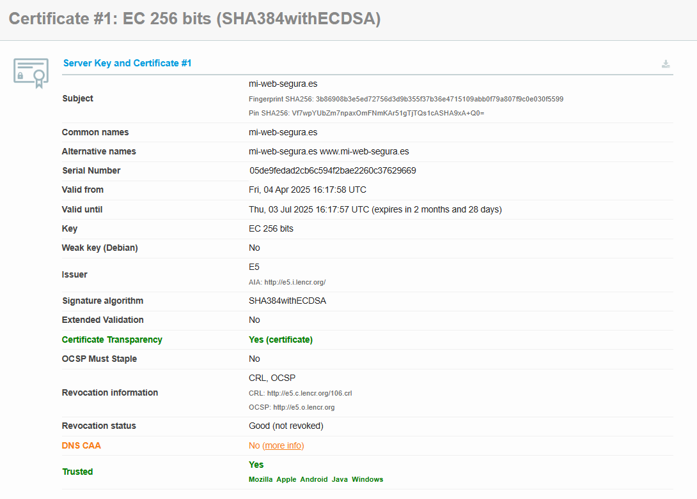

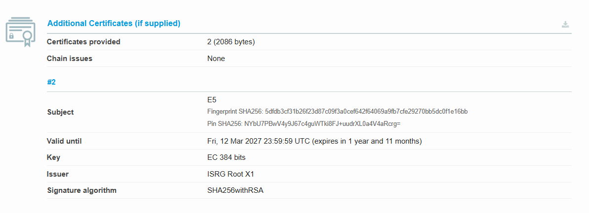

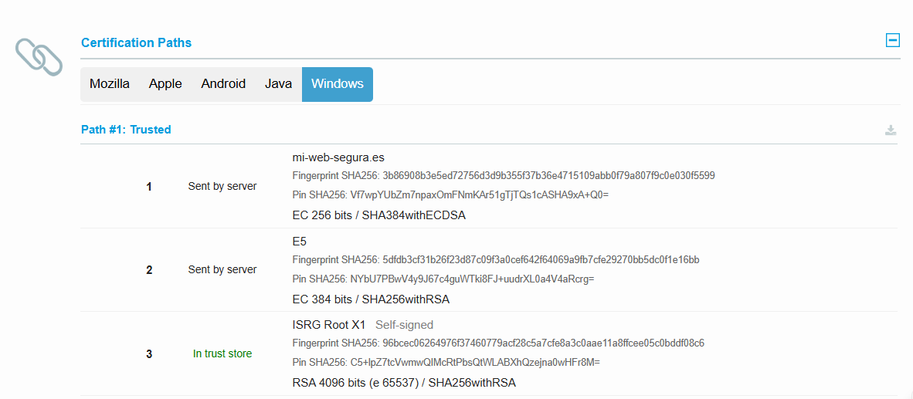

---

### **Configuración Segura (Calificación A)**  
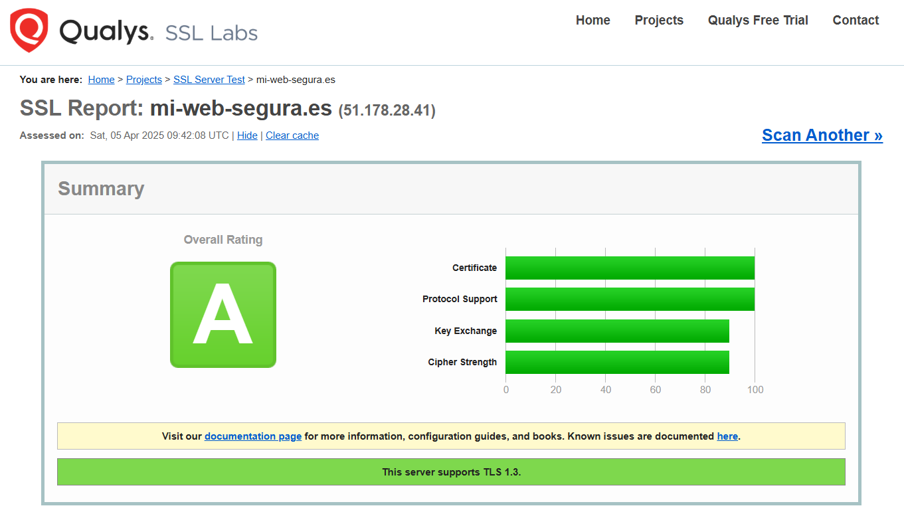

- **Protocolos:**  
  - Soporta **TLS 1.3** y **TLS 1.2**.  
  - Deshabilita protocolos antiguos (SSLv2, SSLv3, TLS 1.0/1.1).  

- **Cifrados:**  
  - **TLS 1.3:** `TLS_AES_128_GCM_SHA256`, `TLS_AES_256_GCM_SHA384`, `TLS_CHACHA20_POLY1305_SHA256`.  
  - **TLS 1.2:** `TLS_ECDHE_ECDSA_WITH_AES_128_GCM_SHA256` (con **Forward Secrecy**).  

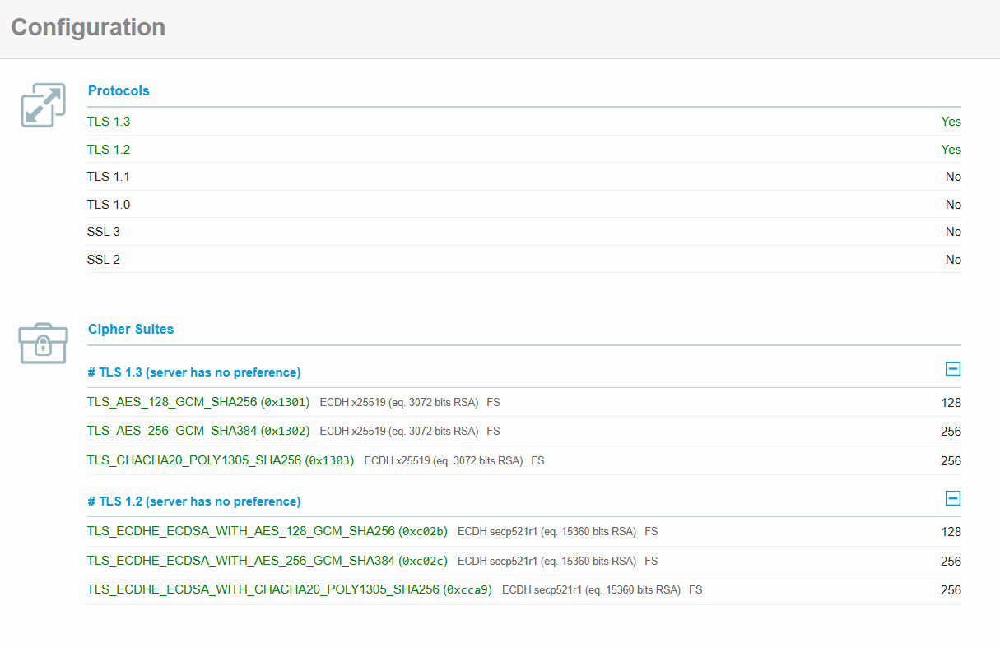

- **Mitigaciones:**  
  - Protección contra **BEAST**, **POODLE**, **Zombie POODLE**, y **Downgrade Attacks**.  
  - **Compresión SSL/TLS deshabilitada** (evita CRIME).  

 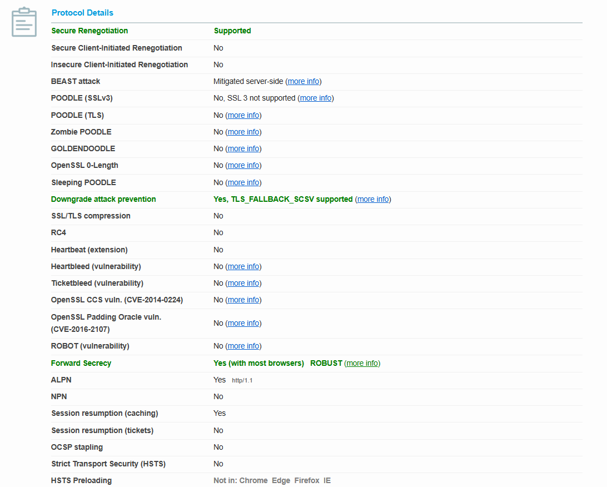

---

## **Certificados Inválidos**  

### **1. Certificado Expirado (expired.badssl.com)**  

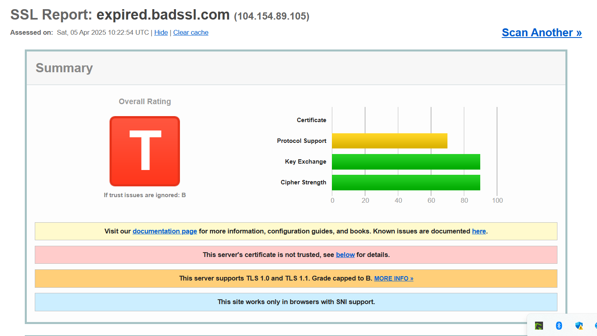

**Motivo de invalidez:**  

Este certificado no es válido porque **expiró el 12 de abril de 2015** (hace más de 9 años).  
SSL Labs lo marca como **"No confiable"** debido a que la fecha actual está fuera de su período de validez.  

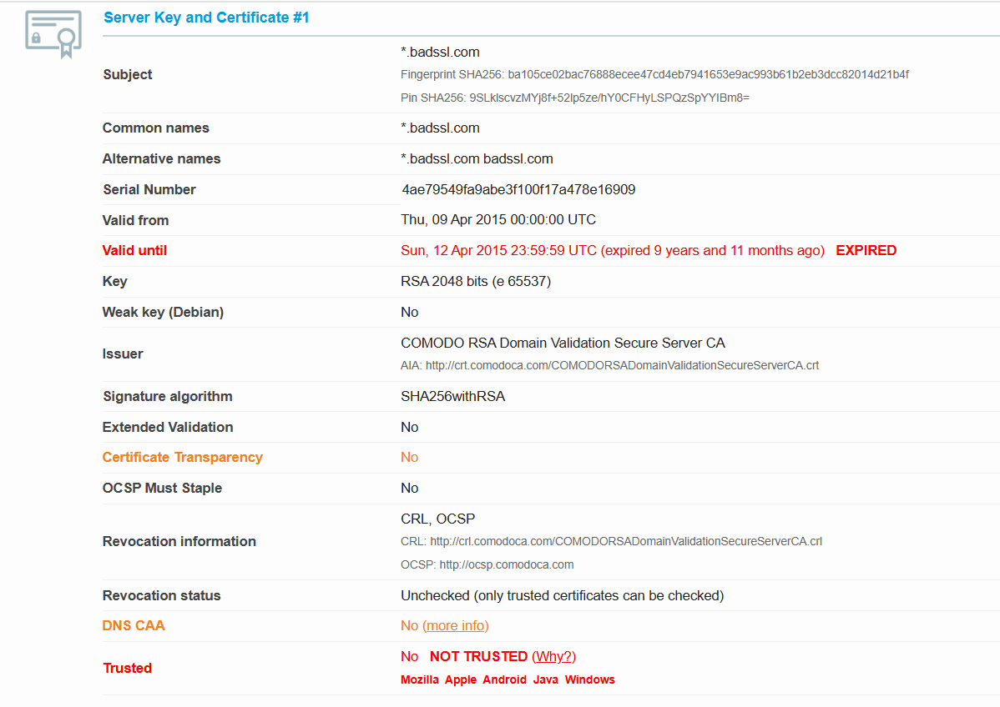

### **2. Certificado  con Coincidencia de Nombre Incorrecta (mismatched.badssl.com)**

**Motivo de invalidez:** 

Este certificado no es válido porque el nombre del dominio (`mismatched.badssl.com`) **no coincide** con el nombre definido en el certificado (`badssl-fallback-unknown-subdomain-or-no-sni`).  
SSL Labs reporta un **"Certificate name mismatch"**.

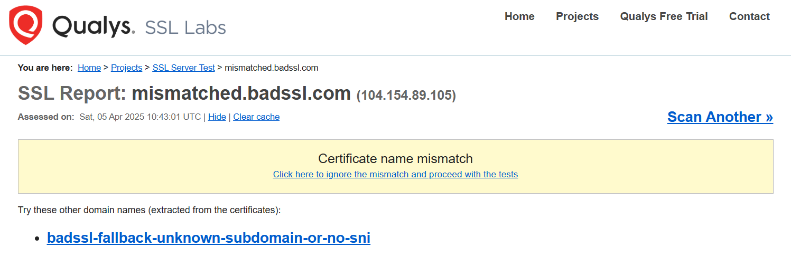

### **3. Certificado Autofirmado (self-signed.badssl.com)**

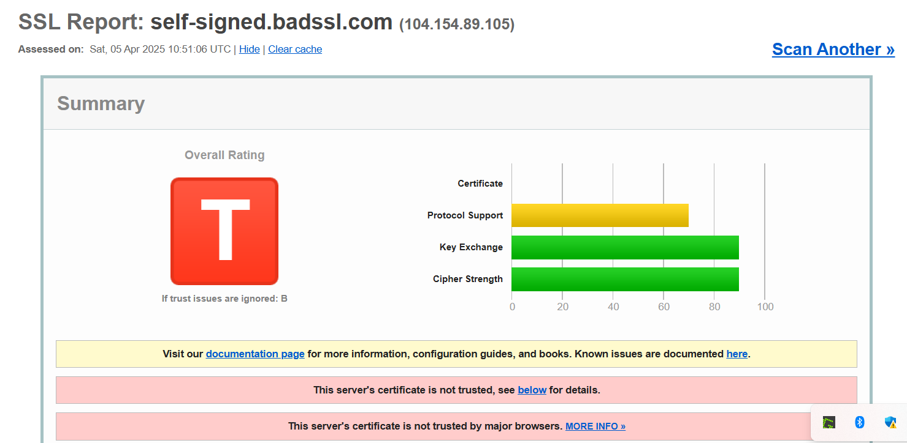

**Motivo de invalidez:** 

Este certificado no es válido porque es **autofirmado (Self-signed)** y no está respaldado por una Autoridad de Certificación (CA) reconocida.  
SSL Labs lo marca como **"No confiable"** en todos los navegadores/sistemas operativos.  

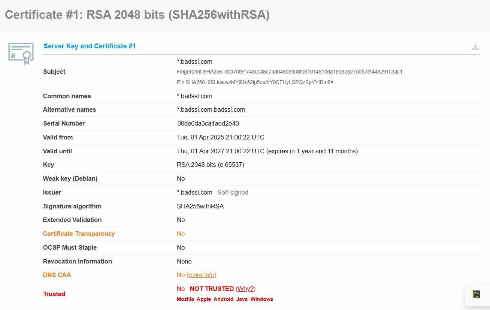

---

## **Conclusión general**
**Certificado válido:** Cumple con todos los requisitos de confianza, validez y seguridad moderna.
**Certificados inválidos:** Fallan en aspectos críticos como expiración, coincidencia de nombres o falta de respaldo de una CA.